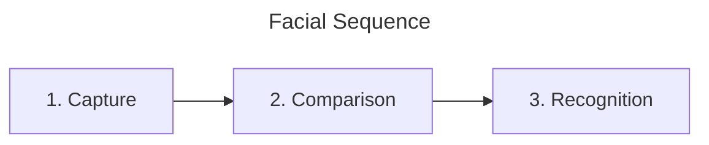
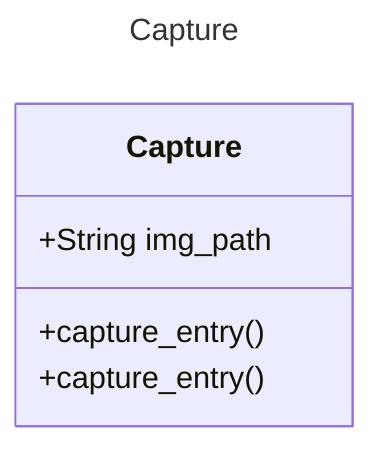
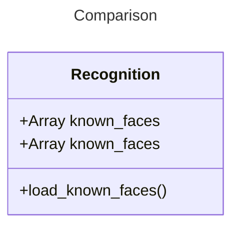

# Components

This folder is the components needed to capture the face from the UI. Controlled by the facialController.

## Flowchart Visualization

## Future Considerations

While it runs fine now, theres a lot of redunancy that could be cut. Additionally, we could benefit from more functions in the facial controller to utilize different functions.

## Components Breakdown

### Comparison

