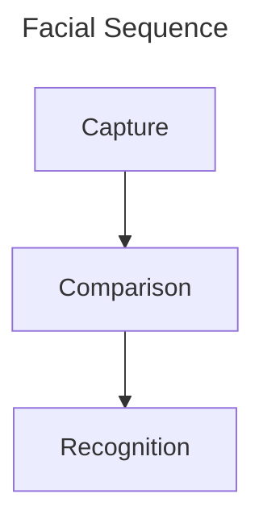

# Components

## Description

This folder is the components needed to capture the face from the UI. Controlled by the facialController.

```mermaid
---
title: Facial Sequence
---
flowchart TD
    Capture
    Comparison
    Recognition

    Capture --> Comparison --> Recognition;
```

