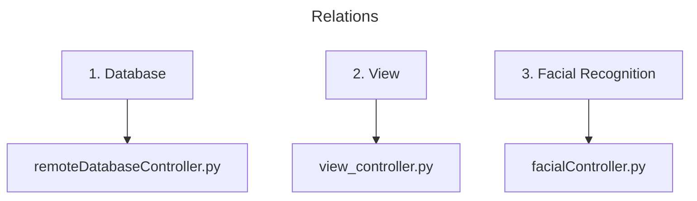

# Controllers

## Description

This controller folder is used to connect the Tkinter View, Database, and Facial Recognition components together.

## How it works

Similar to a MVC sequence. When running from main.py the view initiates the necessary components and first frame which is the choose_user_panel. It also connects to the database and sends and recieves necessary data depending on the view.