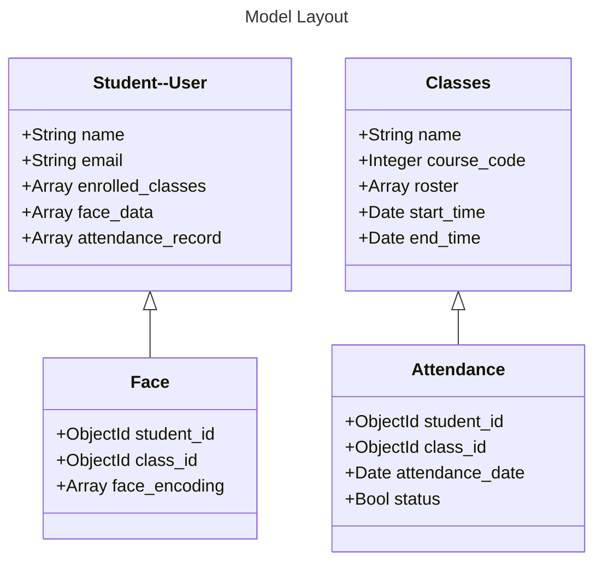

# Models Folder Outline

## Outline

Due to the changes in database it seems necessary to explain the changes. There are 4 model classes that correspond to the user.

1. User
2. Classes
3. Face
4. Attendance

## Notes

1. Still subject to change as I iterate.
2. The User Dataclass is loaded after login (assuming we get to that point).
3. As of now, have not tested the models in the main program.
4. Working on how to manage the relationships between documents in NoSQL MongoDB. Primarily just trying to keep ID's as the relation.
